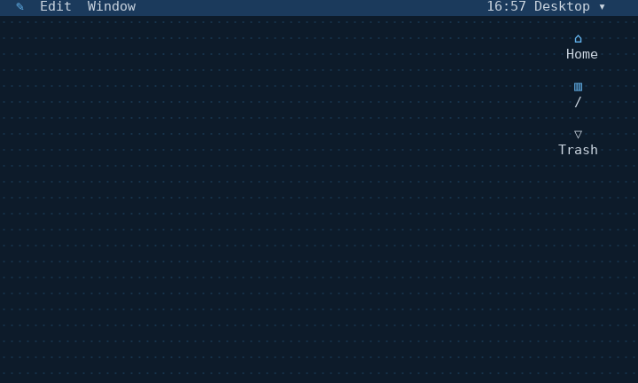
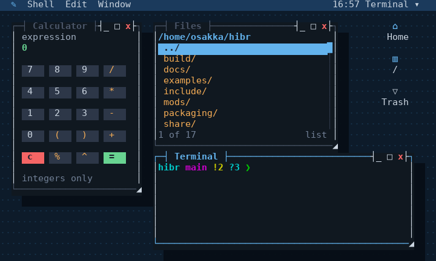
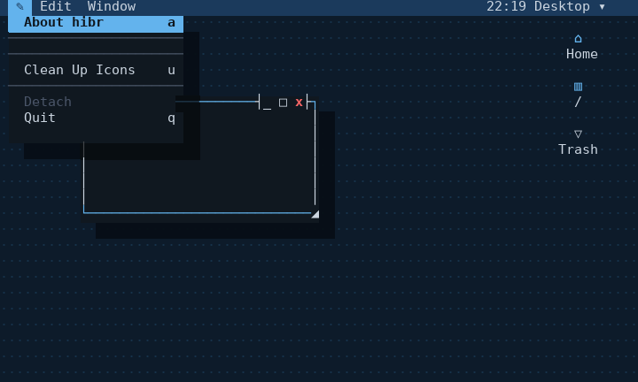
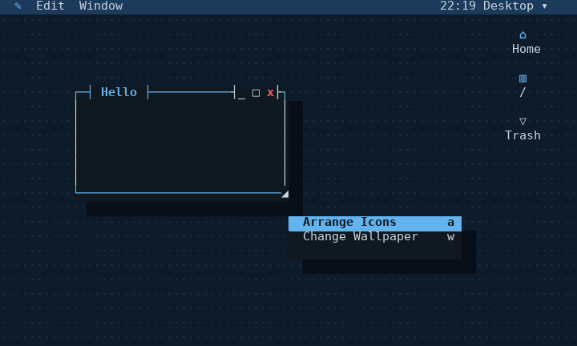
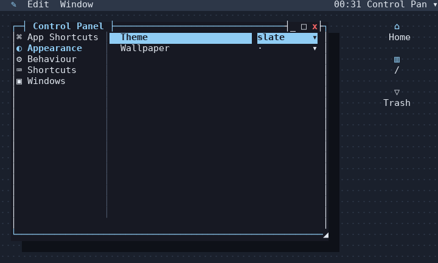
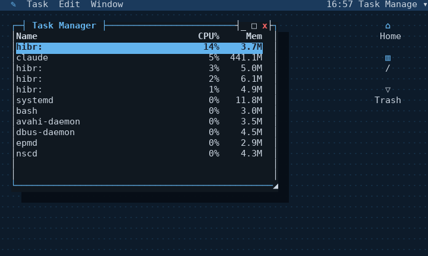

# The desktop's architecture

[Windows on a console](README.md) says what the desktop does. This says how
it is built — the three layers, the event loop, the rendering model, and the
contract an app is written against. Every screenshot below is a real render
of real hibr output, made with [`tools/screenshot.py`](../../tools/README.md),
not a mockup.



## Three layers, X's shape

| X | here | what it is |
|---|---|---|
| the server | the `console` module | owns the terminal, the grid, the mouse, stacking, hit testing |
| the window manager | `examples/desktop/desktop.hibr` | the event loop, focus, dragging, title bars, menus |
| `~/.xinitrc` | your own session file | which windows open, and where |

None of it is C beyond the display module itself. The window manager is a
hibr script; every app is a hibr script; the session that starts them is a
hibr script you write and own, the same way an X session is whatever
`~/.xinitrc` says to run — see
[decision 0020](../../docs/adr/0020-windows-are-drawn-not-composited.md) for why this
split was chosen over compositing panes together in the display module
itself.



That terminal window is not a screenshot of a screenshot — it is a real
`hibr` process, started by `term.hibr` on a pseudo terminal, showing its own
real prompt with the actual git branch this repository is on. Nothing about
what a window shows is faked or simulated for the picture.

## The event loop

`dt_run`, in `desktop.hibr`, is the whole of it:

```
while [ "$DT_QUIT" = 0 ]; do
    dt_draw
    k := console key "${DT_WANT:-$DT_TICK}"
    dt_event "$k"
done
```

(Simplified — the real loop also debounces a burst of resize events into one
settled redraw, described in `desktop.hibr`'s own comments.) `console key
MS` blocks for up to `MS` milliseconds waiting for one decoded key or mouse
report, and returns the instant one arrives — a key is never delayed by the
timeout, which only governs how long the desktop waits with nothing to do.
A resize is delivered the same way: `SIGWINCH` interrupts the wait
immediately, regardless of `DT_TICK`, so neither input nor resize responsiveness
depends on how often the desktop wakes up on its own. `DT_TICK` (2000ms by
default, itself a Control Panel entry) is how often the desktop wakes and redraws
anyway, with nothing to do — the clock in the corner has to advance, a
throttled app that has not called `dt_want` has to get its own redraw. This
is a periodic-poll design, not a purely event-driven one: a `tmux` or
`screen`, blocked on `select()` with no timer at all, spends zero CPU while
genuinely idle. hibr's desktop still wakes and redraws (cheaply, since
nothing changed means nothing is sent — see below) every `DT_TICK`, so it is
not zero either, but raising the default from an original 200ms — chosen
without measuring what it cost — to 2000ms cut two real, live sessions'
measured idle CPU from 1.6-2.2% of one core to 0.15-0.2%, about a tenth,
with no change to input latency: `tests/desktop.py` and `tests/apps.py`,
which set their own short `DT_TICK` for fast, deterministic runs, do not
depend on the default at all and passed unchanged. An app that redraws
itself only on a timer, not on `dt_want`, would now update less often while
idle — Tasks already asks with `dt_want 500`; About does not yet, and still
relies on being drawn every default tick to notice its own 3-second
throttle has elapsed.

`dt_draw` walks every open window bottom to top, drawing its face and letting
its own `_draw` callback fill it in, then the menu bar and whatever floats
above everything — a menu, a drag, the confirm box. `dt_event` decodes one
key or mouse line and dispatches it: to a confirm box or a rebind capture if
one is pending, to the open menu if one is, to the focused window's own key
handler, and only once all of those have declined it, to the handful of
global shortcuts (Control Panel has the current list).

## Redrawing costs only what changed

The console module keeps two grids, front and back. Every `dt_draw` writes
into the back grid; `console flush` compares it against the front and sends
only the cells that differ, then makes the two match. A full first paint of
an 80x24 screen costs a few kilobytes; a completely unchanged frame costs
zero bytes, not a redraw with nothing in it — the comparison itself is real
CPU work, but nothing crosses the pty. This is what makes the periodic poll
above affordable at all: the tick costs a wake-up and a grid diff, not a
full terminal repaint five times a second.

## An app is a prefix, not a class

There is no window object, no base class, no registration beyond a name. An
app called `calc` is whichever of these functions it happens to define —
`calc_draw`, `calc_key`, `calc_click` or `calc_mouse`, `calc_open`,
`calc_close`, `calc_menus` — checked for with `command -v` once, when the
window is made, and only the ones that exist are ever called. Everything an
app remembers is keyed by the window id it was handed, never a bare global,
since two windows of the same app must not share one:

```sh
calc_draw() {
    local id=$1 h=$2 w=$3          # window id, body height, body width
    console put -p "w$id" 1 2 "${CA[$id]["out"]}"
}
```

`console put -p "w$id" row col text` writes into that window's own pane,
in the coordinates the window draws in — row 0 is its own top border, not
some outer coordinate system the app has to translate into. A `_click`
callback is told a click in exactly those same coordinates; a richer
`_mouse` callback additionally gets the raw press, drag, and release, which
is what a terminal emulator or a file browser's own drag-and-drop needs.

## Menus, two kinds

The bar across the top is rebuilt every frame from whatever has focus: the
hibr menu, Edit and Window (which belong to the desktop, not any app), and
the focused app's own menus if it defines `<app>_menus`, built with
`dt_menu`, `dt_item`, `dt_sub`, and `dt_sep`.



A right-click gets a different menu, specific to what was clicked rather
than to what has focus — the desktop background, a title bar, or an app's
own `<app>_context` if it defines one:



## Control Panel settings are a script, not a format

Nothing about the desktop's configuration is a config file format of its
own. `dt_save` writes plain assignments and setter calls to
`~/.config/hibr/desktop.hibr`, `dt_load` sources it back — a script like
any other, editable by hand, and it is exactly the plain variables the
window manager already reads every frame (`DT_WALL`, `DT_TICK`, `DT_KEYS`,
and so on), so a change takes effect the moment it is written, in every
window at once, without anything being told to refresh. `panel.hibr`, the
Control Panel app, is what edits it interactively — not with settings of
its own, but as a host for panes, each an ordinary file under
`examples/desktop/control-panel`, System 7's Control Panels folder rather than one
long scrolling list:



A pane down the left, its own rows on the right — arrows move the picker,
tab or right or enter steps into the selected pane, and the same keys then
move its row cursor instead. Appearance and Behaviour hold what used to be
one flat list's worth of settings; Shortcuts holds the four fixed desktop
bindings — Close Window, Detach, Quit, Cycle Windows — rebindable by
selecting the row, pressing enter, then the new key; App Shortcuts lists
every registered app the same way, empty by default, so any app can be
given a global launch shortcut, not just the two (Terminal and Task
Manager) that ship with one; Date & Time draws its own body instead of
rows — the clock, the date, and a small
world map with a mark near the machine's own time zone, reusing
`examples/traceroute.hibr`'s own map and zone1970.tab lookup rather than a
second copy of either. See
[Control Panel panes](README.md#control-panel-panes) for the two shapes a
pane can take and how `CP_PANEDIRS` finds them.

## A real app, for scale

The task manager reads `/proc` directly on Linux, no forking, throttled to
once a second; it is not a mockup of a process list, it is this machine's
actual processes at the moment the screenshot was taken:



## What this is not

It is not a compositor: nothing is transparent, nothing overlaps with
blending, and a window's shadow is a darkened copy of the cells under it,
computed once per frame, not a rendering effect. It is not accelerated:
every cell is a real character cell, drawn with real SGR escape sequences,
at whatever rate the terminal it runs in can keep up with. And it does not
yet match a purely event-driven multiplexer's idle cost — see the note under
[the event loop](#the-event-loop) above, and the project's own
[backlog](../../docs/backlog.md) for what is still open about it.
