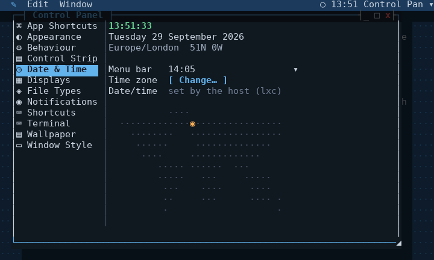
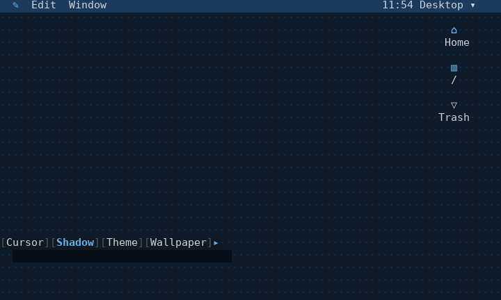

# Windows on a console

hibr can put draggable windows on a text terminal, with apps written as
ordinary hibr functions. Nothing here is new C beyond the display module and
sixty lines of stacking in it: the window manager itself is a script, and so
is every app.

There are three layers, and they are X's, which is the clearest way to
describe them:

| X | here | what it is |
|---|---|---|
| the server | the `console` module | owns the terminal, the grid, the mouse, stacking, hit testing |
| the window manager | `examples/desktop/desktop.hibr`, sourcing `wm/` and `widgets/` | the event loop, focus, dragging, title bars; the widgets apps draw with |
| `~/.xinitrc` | your own session file | which windows open, and where |

Try it, from a checkout:

    ./build/hibr examples/desktop/session.hibr

Or, once `make install` has put this whole directory at
`$PREFIX/share/hibr/desktop` (`/usr/local` by default) and a small wrapper
at `$PREFIX/bin/desktop`:

    desktop

`desktop --resume` and `desktop --session name --resume` work the same as
running `session.hibr` directly does -- the wrapper forwards its own
arguments straight through, it does nothing else.

Drag a title bar to move a window, and any of its four corners to resize
it -- the `◢` at the bottom-right is the one this always had; the other
three work the same way, whichever one is dragged staying opposite a
corner that does not move. `_` minimises, `□` fills the screen, `x`
closes, and holding alt while dragging anywhere in a window moves it
(Control Panel > Mouse). `alt-tab` cycles windows, `ctrl-w` closes the
focused one, `escape` or `F10` opens the menu bar, and Quit on its hibr
menu ends the desktop and gives the terminal back -- it has no key of its
own by default, so no stray keystroke ends everything. Each of these keys
can be changed, or Quit given one, in Control Panel > Shortcuts.

**Where a new window goes** is Control Panel > Windows > Placement.
**smart**, the default, puts it in the first spot on the display that
overlaps nothing -- scanning from the top left, below the menu bar, clear
of the Control Strip, with room left for each window's shadow -- and where
there is no such spot, where it covers least. **cascade** steps each new
one down and across, as the desktop always did; **center** puts it in the
middle. A window bigger than the display is shrunk to fit. A session's own
`dt_new` with a position is left where it says.

**Snapping** puts the focused window on a half of the display: ctrl-alt-left
and ctrl-alt-right, alt-up and alt-down -- or Window > Snap, which also has
Center. Snapping the same way again puts the window back where it was. A
fixed window can only be centred. The keys are Shortcuts like any other;
Center has none until you give it one.

**Workspaces**: three by default (Control Panel > Desktop > Workspaces, 1
to 9), for the whole desktop at once, every window on the one that was
current when it opened. The bar shows the numbers left of the notification
icon, the current one lit; click one to go there, or drag a window by its
title onto one to send it there. alt-1, alt-2 and alt-3 switch,
alt-right and alt-left step through them (Workspace 4 to 9 have
no key until given one), and so does the mouse wheel over the bare
desktop or the bar -- down to the next, up to the previous, one step a
notch. A window that uses alt-left and alt-right itself keeps them while it
has focus -- the Browser's back and forward -- and a terminal gives them up
to the desktop, as it does every desktop shortcut. Window > Move to Workspace sends the focused window, and a title
bar's right-click menu has the same for its own. Window > On Every
Workspace (or the title bar's right-click menu) makes a window sticky: it
stays in view whichever workspace is current, floats over a tiled one, and
taking it off leaves it on the workspace you see it on -- as does sending
it to one workspace. With one workspace the
bar shows no numbers and none of this appears. Cycle (alt-tab, or
Window > Cycle) goes through this workspace's windows; Control Panel >
Desktop > Cycle Windows On set to `all` goes through every workspace's,
from this one on and round, going to whichever one holds the next window.
The application menu lists every window, marked with its
workspace's number when it is on another; choosing it goes there, and so
does opening an app that is already open on another.

**Tiling** is a workspace's own: Window > Tile Workspace (or its
shortcut, unset until you give it one) and the desktop lays that
workspace's windows out itself -- the main one on the left, Control Panel
> Windows > Tiled Main per cent of the display wide, the rest stacked down
the right -- and lays them out again whenever one opens, closes, hides or
moves between workspaces. Window > Make Main puts the focused window on
the left; dragging a tiled window by its title onto another swaps the two.
A fixed window floats over the layout, and a tiled window cannot be
resized by hand. Turned off, the windows stay where the layout put them.

A button presses then releases, the same as any other clickable thing in a
real GUI: held down, it shows inverted, and dragging off it before letting
go cancels whatever it would have done -- nothing fires until release, and
only if release lands back on the same button.

A double click on the title bar itself does the same as `□` by default --
`DT_DBLACTION`, a Control Panel entry, can change that to minimise, close, or
nothing at all. It never zooms a fixed window, the same restriction `□`
itself already has.

A minimised window has no pane at all, so nothing draws it and nothing can
click it. Its label on the bar across the top is the only way back — click it
to restore the window. The bar also says how many windows are open and how
many are hidden.

A window casts a shadow, one row down and two columns right, darkening
whatever it falls across -- another window, or the desktop underneath.
`DT_SHADOW`, a Control Panel entry, turns it off; it costs one `console darken`
call per window, and nothing at all when off.

An open menu -- a bar menu, a submenu, a right-click context menu, or a
dropdown's own popup -- casts one the same way, governed by its own
`DT_MSHADOW` instead: a menu is drawn far more often than a window moves, so
whether to pay for its shadow is a separate choice from a window's.

The menu bar itself casts a shadow too, one row straight down across the
full width of the screen, giving it a sense of sitting above everything
else -- `DT_BARSHADOW`, a third and separate setting again, since the bar
is drawn every frame it is visible at all (always), which is neither a
window moving nor a menu opening.

How dark a shadow falls is `DT_SHADOW_PCT`, part of the theme rather than one
constant: a theme's `shadow` sets it alongside the other seven colours.
Scaling an already-dark face down by console darken's own default (55, a 45%
cut) is a small absolute change and reads as soft against a dark theme, but
the same cut off paper's near-white face lands on a flat medium grey -- a
hard block, not a shadow -- so paper alone gets a much gentler one.

## Themes and colours

A **theme** is the whole look at once: a colour scheme, and the wallpaper,
window frame, title bar, buttons, checkboxes, shadows and glyph set to go
with it. Appearance > Theme chooses one, and every setting it carries can
still be changed on its own afterwards. Three come with the desktop --
classic (midnight, as the desktop has always looked), construction
(black-and-yellow hazard stripes, yellow windows, double frames, solid
black title bars) and meadow (a sky over a green hill, beige windows with
rounded frames and blue title bars, after the desktops of around 2001).
Appearance > Save Current Look as Theme… writes the look as it stands to
`~/.config/hibr/themes/` under a name you give it, and it joins the list.

A theme is a JSON file too:

<!-- not run: a data file the Appearance pane reads -->
```text
{
  "colours": "hazard",
  "wallpaper": "╱",
  "image": "construction.png",
  "mode": "zoom",
  "frame": "double",
  "titlebar": "solid",
  "buttons": "squares",
  "checks": "block",
  "dialog": "filled"
}
```

`colours` names a colour scheme and is the one key a theme must have. The
rest, each optional: `wallpaper` (a glyph from Appearance's list), `image`
and `mode` (a picture, its path relative to the theme's own folder so a
theme can carry it, and how it is fitted), `frame` (`single`, `double`,
`rounded`, `none`), `titlebar` (`line`, or `solid` -- the top row a bar of
the frame's colour), `buttons` (`brackets`, `circles`, `squares`,
`diamonds`, `dashes`), `side` (`right`, `left`), `align` (`left`,
`center`, `right`), `checks` (`theme`, `box`, `knob`, `block`), `dialog`
(`filled`, `brackets`), `glyphs` (`unicode`, `ascii`), and `windowshadow`,
`menushadow`, `barshadow` and `buttonshadow` (`true` or `false`). What a
theme leaves out is the desktop's default, so it looks the same whatever
came before it; a value the setting cannot take leaves the file out of the
list whole.

A colour scheme is a JSON file of seven colours and a shadow strength, one
file to a scheme and named for it. The twelve that come with the desktop
are in `examples/desktop/colours/` (installed under
`share/hibr/desktop/colours`); your own go in `~/.config/hibr/colours/`,
which is read first, so a file there named `paper.json` replaces the
bundled paper and any other name adds a scheme. A colour file in
`~/.config/hibr/themes/`, where they all lived before 0.99.33, is still
read as one. Appearance's Colours row lists them all, sorted by name.

<!-- not run: a data file the Appearance pane reads -->
```text
{
  "wall": "#0d1b2a",
  "dot": "#16324a",
  "bar": "#1b3a5c",
  "active": "#63b3ed",
  "idle": "#4a5568",
  "face": "#101820",
  "ink": "#cbd5e0",
  "shadow": 55
}
```

`wall` is the desktop behind everything and `dot` its wallpaper glyph;
`bar` the menu bar; `active` the focused window's frame, the selection and
anything highlighted; `idle` an unfocused frame and dimmed text; `face`
the inside of windows and menus; `ink` the text on it. `shadow` is how much
of a colour survives under a shadow, 1 to 100: 55 is soft on a dark face,
and a light one wants much less of a cut -- paper's is 90. `checks`,
optional, suggests how an on/off choice is drawn -- `box`, `knob` or
`block` (neon suggests `knob`) -- and holds while Appearance > Checkboxes
is left at `theme`; choosing a style there is yours whatever the theme.

A scheme may also set seven colour roles, each optional: `dim` (secondary
text), `selink` (text drawn on the accent, a selection), `good`, `warn` and
`bad` (the traffic-light buttons, an answer, an error, an exit status),
`info`, and `well` (the darker surface keys and cells sit in). One left out
is what the dark schemes share, so a file with only the seven colours
keeps working; paper, phosphor and amber set their own, so a light scheme is
not drawn with dark-scheme greys and the monochrome ones stay one hue. Every colour must
be `#rrggbb` and the shadow a whole number in range, or the file is left
out of the list; a scheme added while the desktop runs appears at its next
start. Why JSON and not a script is
[decision 0028](../../docs/adr/0028-a-theme-is-data.md): a file you were
given can only ever be colours and settings.

## Glyphs

Every character the desktop draws that is not plain text -- a border, a
scrollbar, a slider's knob, a sort arrow, a menu's tick -- is named in
`wm/glyphs.hibr` and drawn by its name, `${GL[vline]}` rather than a
literal `│`. Appearance > Glyphs picks the set: **unicode**, the default,
or **ascii**, which draws the same desktop in plain characters (`+-|`, `#`,
`[ Title ]`) for a terminal or a font without the others -- a Linux
console, an older ssh client. The icon each app and pane chooses for
itself stays as its own `dt_app` or `cp_pane` line writes it.

## The wallpaper

`dt_wall` fills the whole screen before anything else draws: `DT_GLYPH`
repeated (`·` by default, Appearance's own Wallpaper row and the strip's
`wallpaper` module both cycle it), or a real picture in `DT_WALLIMG` instead
when one is set. A picture is decoded and drawn by the `img` module
(`mods/img`, `need img` on first use so a desktop that never sets one never
loads it) -- `img draw` blits it straight into the display, resampled to
fill the screen exactly, cached by the module itself so a redraw every
frame does not mean a decode every frame. The two are mutually exclusive in
the UI: picking a glyph clears `DT_WALLIMG`, and a picture wins over the
glyph when both happen to be set. Setting one at all means opening a
picture in the desk accessory `imgview` (drop a file onto it, since there
is no file-open dialog anywhere in this desktop) and choosing "Set as
Wallpaper" from its own **Image** menu. If the file cannot be decoded --
moved, deleted, not actually a PNG -- `dt_wall` falls back to the glyph
rather than leaving the screen blank.

## Icons on the desktop

A clean desktop, down from the top right: **Home**, the mounted **disks** if
`DT_DISKS` wants them (real block devices only -- `/proc/mounts` filtered by
filesystem and by a `/dev/` device, so tmpfs, proc, cgroups and the dozen
other things a kernel mounts never show up as one), and the **trash**, drawn
full when it is not empty. Apps stay in the hibr menu, not here, and nothing
in `~/Desktop` gets an icon just for being there -- the desktop is not a
second copy of a folder. A **double click** opens one: Home and a disk in
Files, the trash in Files on what it holds.

**Choose several**: ctrl and a click adds an icon or takes it away, shift
and a click takes the run from the last one chosen (where the terminal
passes shift-click on; many keep it for their own text selection), and a
drag across the empty desktop draws a band that selects every icon it
touches. With no window focused the keyboard works too: the arrows go from
icon to icon, shift with them extends the selection, space picks or drops
one, ctrl-a takes them all, enter opens what is selected. alt-c copies their
paths.

**Drag** an icon somewhere empty and it stays there, remembered in the
settings file with the rest; drag a selection and it moves together, keeping
its arrangement. Positions are clamped to the screen every time it is laid
out, not just when one is dropped, so a spot picked on a wide screen cannot
put an icon under the bar or off the edge after a resize to a narrower one --
`dt_size` calls `dt_iconlay` on every resize for exactly this. Special >
Clean Up Desktop forgets every saved position and lays them out fresh, for
when they have drifted somewhere inconvenient anyway.

**With no window focused the desktop is the Finder**, and its menus are
System 7's: **File** (New Window, Open what is selected, Find…), Edit,
**View** (Desktop Icons on or off, Refresh) and **Special** (Clean Up
Desktop, and Empty Trash…, which asks first and then deletes for good).
Every app with menus of its own puts File and Edit first in the same way.

**About follows the front app.** The hibr menu's first item is *About
Files…*, *About Calendar…* -- whatever is in front, a helper window such as
Calendar's event editor answering for its app -- with About hibr Desktop
below it. An app that defines `<app>_about` shows its own; any other gets
the desktop's card: its icon and name, the line its `app` declaration
describes it with, the file it came from, and the shell's version.

**Home and a disk are never something delete or a drag can lose.** They are
a kind of their own, `place`, deliberately left out of every path a move or
a trash can act on -- dragging Home onto the trash icon, or pressing delete
with it selected, does nothing, on purpose: dragging Home into the trash
used to mean the whole home directory, moved. Copying a place's path with
alt-c is still allowed, since that only ever produces text. Icons can be
switched off in Control Panel (`DT_ICONS`), and the disks specifically with
`DT_DISKS`, or with either in the session.

## Open, Save As and Export

One dialog does all three, in every app: a folder's contents, folders first,
only the kinds of file the app works with -- the Type dropdown shows the
others, and All files -- and beside the list a preview of what is selected,
a text file's first lines or a folder's count. Arrows move, enter opens a
folder or chooses a file, backspace goes up, `~` goes home, and a `/`
starts typing a path. Save As adds the type's extension when the name has
none and asks before replacing a file; each app comes back to the folder it
last used. Write's Open…, Save As… and Export… (HTML, or plain text as it
reads) and dBASE's New Database… and Open Database… are this dialog; an app
asks for it with

<!-- not run: a desktop function, called from an app's menu -->
```sh
dt_filepick save "Export" "HTML:html htm|Plain text:txt" "$dir" "notes" my_export "$id"
```

and is called back as `my_export id path type`.

## Open With, and a terminal in a folder

Right-click a file in Files and **Open With** lists every app that can open
it -- the one a double-click uses first, marked default, then the others,
then **Other…**, which takes a command and runs it on the file in a
terminal. Choosing one opens the file there this once; nothing is
remembered. Control Panel > File Types has an **Open With** row for each
type: tick the apps it lists, press d on the one that should be the
default -- what a double-click does from then on -- and Save, or Reset to
go back to every app in its usual order.

**Open Terminal Here** opens a terminal whose shell starts in the folder
right-clicked, or in the one shown. Control Panel > Files can take either
item off the menu, and sets the shell Terminal Here starts: your `$SHELL`,
or hibr, bash, zsh or sh.

An app that opens files says which, so it is offered:

<!-- not run: a line from a desktop file, read when the desktop loads it -->
```sh
dt_opener imgview "Image Viewer" "png ans" app imgview
```

`dt_opener <name> <title> <extensions> app|edit|run [app]` -- the
extensions space-separated, `*` for any file and `x` for one that may be
run.

## Files between windows

Drag a file out of a Files window and let go over another: over a Files
window it goes into the folder shown, or into the folder it was let go on;
over a terminal window its path is typed in, quoted for a shell. A drop
**moves**, and **copies with ctrl held**. Nothing is ever put over something
already there, and a folder cannot go inside itself -- the desktop says so
instead. Escape while dragging cancels.

A selection drags whole: every file in it moves or copies, and one note
says how that went -- "Moved 3 items to project", or the first thing
refused and how many more were.

An app starts a drag with `dt_dnd label glyph path...` from its `_mouse`,
and takes one with `_drop`; the moving and copying is `dt_fileop`, once, so
every app refuses the same things. `dt_trash path` moves a file to the trash
at `~/.local/share/Trash`, the freedesktop one, so what is thrown away here
turns up in any other desktop's trash on the machine. `dt_openfile path`
opens a folder in Files, a registered handler if one matches the name's
extension (see **Application handlers** below), and anything else in a
terminal with hvi.

**Right-click** an entry, or empty space in the list, for a menu of its
own: Open, Open With (only when a handler is registered, listing every one
by the program it runs), Cut, Copy, Paste, Info, and Move to Trash --
dimmed for what does not apply to the entry under the pointer, or to `..`.
Cut marks the clipboard so the next Paste moves the files instead of
copying them; Paste itself, and the note it leaves, say which happened.
The desktop's own background and every window's title bar have their own
right-click menus too, unrelated to this one -- Arrange Icons and Change
Wallpaper on the desktop, Move/Resize/Zoom/Hide/Close on a title bar.

In the file browser a click selects one entry; ctrl and a click adds or
takes away; shift and a click takes a run; shift with the arrows carries
the selection along; space marks the entry under the cursor and steps on;
ctrl-a takes everything but `..`. A plain click on something already
selected keeps the rest until the button comes up, so the selection can be
picked up and dragged; the footer says how many are chosen.

The file browser has three views, which `v` cycles and the View menu picks:
a **list** of names; **details**, with size, time and permissions from one
`ls -l` per folder, dropping columns from the right as the window narrows;
and **icons**, a grid the arrows move across and down. Delete moves the
selection to the trash; alt-c copies its path, and alt-v in a Files window
copies the file whose path was pasted into the folder shown.

## Copy and paste

**alt-z** undoes and **alt-y** redoes in anything that edits text, and
Select All is on the Edit menu beside them.

**alt-c** copies, **alt-x** cuts, and **alt-v** pastes, in every window --
each a key you can change in Control Panel > Shortcuts, and the change
applies everywhere at once -- and all three are on the **Edit** menu, which
shows the key each has now. The menu belongs to the desktop like Window
does: the same three items everywhere, dimmed where the focused app cannot
do them -- most apps have no Cut, since most things there are not files. An
app offers `<app>_cut` the same way it offers `<app>_copy`, and its
`<app>_paste` is handed a third argument, `cut` or `copy`, so the file
browser is the one thing so far that tells them apart. There is one
clipboard for the whole desktop, and a copy or cut also goes to the
clipboard of the terminal the desktop runs on through OSC 52, so it pastes
into anything else on the machine -- where that terminal allows it, which
most modern ones do and some ask about first. A held desktop sends it to
every terminal attached, so with a second machine joined (`--join`) a copy
lands on both machines' clipboards.

What each app copies and takes:

| app | copies | a paste |
|---|---|---|
| Terminal | the text dragged over | is typed into the program |
| Stickies | the text selected -- shift with the arrows, home and end, ctrl with them for words, or a drag | goes in at the cursor, over any selection |
| Files | the selected files, as paths | of paths copies (or after Cut, moves) those files here; of other text saves it as `Pasted text.txt` |
| Image Viewer | the picture, as its file | -- |
| Calculator | its answer | of arithmetic is taken as input |
| dBASE | the line being typed, at the prompt or in an APPEND field | goes in at the cursor |
| Sheet | the selected cells, tab-separated, each as it was typed (a formula as its formula) | of tab-separated lines fills the grid from the cursor |
| every dialog's text field -- Rename, Get Info, File Type, Clock Format, Set Date & Time, Time Zone, Screenshot Folder | the whole field (cut empties it) | goes in at the cursor, on one line |
| Task Manager | the selected process, its pid and name | -- |
| Process Details, About | what they show | -- |
| Notifications | the selected note (cut also clears it) | -- |
| Clock | the time and date | -- |

**Everything copied is kept.** The **Clipboard** desk accessory lists it,
newest first: when it was copied, ★ on what is pinned, • on what is on the
clipboard now. Enter makes one the clipboard again, p pins it -- pinned
ones are never dropped -- and delete removes it; pasting into the
Clipboard keeps what was pasted, to come back to later. The last 50 are
kept between desktops, in a file in the state folder only you can read;
Control Panel > Clipboard sets how many, or keeps none on disk at all, and
clears the history (pins stay).

A paste from the machine itself -- the terminal's own paste, cmd-v or
ctrl-shift-v -- goes to the focused window and also becomes the desktop's
clipboard, so alt-v pastes it again anywhere, on any display. A program
inside a Terminal window can set the clipboard too, with OSC 52 -- vim's
`"+y` with a clipboard provider that uses it, tmux's `set-clipboard` -- and
it reaches the desktop and every attached machine; Control Panel >
Terminal > Programs Set Clipboard switches that off. A program asking to
*read* the clipboard is never answered.

Control Panel > Terminal > Copy on Select copies a terminal's text the
moment the mouse lets go of it, as xterm does, without alt-c. What was
copied stays lit, and the next key only puts the highlight out -- it is not
sent to the program, so an enter pressed out of habit after copying does not
run whatever is half typed on the line.

Text is what crosses between a machine and the desktop. Files and pictures
copy and paste as files inside the desktop, but a picture or a file on a
machine's own clipboard cannot reach it: a terminal carries text only.

## Folders on servers

Files reaches a WebDAV server -- Nextcloud, ownCloud, a NAS, Apache or
nginx DAV, rclone, anything that speaks it -- as though it were a folder
here. **Servers > Connect to Server…** in Files (or **Add Server…** in
Control Panel > Network Servers) asks for a name, the server's address,
a user and a password, and whether to check its certificate; **Test**
tries what is typed before anything is saved. For Nextcloud the address
is `https://HOST/remote.php/dav/files/USER`, and an app password is the
one to give it. Every server is then on the Servers menu, and Files
shows it as `NAME:/` in its title.

In a server's folder Files does what it does anywhere: enter goes in,
backspace comes back, `n` renames, **New Folder** makes one, Get Info
shows the size, time, type and ETag. Dragging, Copy and Paste work
between a server and a local folder in either direction, and between
two servers; nothing is ever put over something already there. A
transfer runs in the background with a note when it starts and one when
it ends, so a large file never stops the desktop. There is no trash on
a server, so delete asks first, and what it removes is gone.

Opening a file on a server fetches a copy into
`~/.cache/hibr/dav` and opens that, in whatever opens the type. While
**Upload Edits on Save** is on (Control Panel > Network Servers), saving
the copy puts it back -- but only over the version it was fetched as.
If someone changed the server's copy in the meantime, the edit goes up
beside it as `name (conflict DATE).ext`, and a note says so; nobody's
work is overwritten. **Clear Cache** empties the copies, keeping any
edit not yet saved to its server.

Servers are kept by the dav module in `~/.config/hibr/dav`, readable
only by its owner; the Control Panel and the dialog never show a
password, and leaving the field empty when editing a server keeps the
one it has. How long a server may take is **Timeout** in the same pane.
See [mods/dav](../../mods/dav/README.md) for the module itself.

## YouTube

**YouTube**, in the Internet folder, searches YouTube and plays what it
finds in a window: the picture as coloured half blocks (or ASCII), the
sound through the machine's own device. Type a search and press enter;
up and down choose, enter plays. While playing: space pauses, left and
right are five seconds (with shift thirty), up and down the volume, `m`
the picture, escape back to the list, and a click on the bar goes there.

A search lists playlists and channels as well as videos; enter on one
shows its videos under its own title, and escape goes back to the list
before. Typing or pasting a playlist's, a channel's or a video's address
opens it directly. In the player `n` and `p` play the next video in the
list and the one before, and at the end of one the next plays by itself
(Play > Play Next Automatically). Everything watched goes in a history
(`h`, or Go > History) with where it was left, and choosing it again takes
it up there; `f` keeps a video, a playlist or a channel as a favourite,
starred in every list, and `v` lists them. Both are files of their own in
`~/.local/share/hibr/youtube/`.

YouTube's own page does the fetching, in the web module's headless
Chromium: its player is asked for its lowest quality -- plenty for a
window of cells -- and muted, and every chunk it plays is copied into a
media player here, which decodes it with FFmpeg's libraries. So it needs
Chromium or Chrome and FFmpeg's libraries, and it follows YouTube's own
player wherever YouTube takes it -- including its ads, which come through
the same way. YouTube's player can still give up part way -- its own
"Something went wrong" -- or not start at all; the app notices within a few
seconds, loads the video again and takes it up where it was, and says so,
and only after three tries in a row does it stop and tell you. Control
Panel > YouTube sets the picture, the quality asked
for, and how many frames a second are drawn and how finely, which decide
how much a terminal is sent; whether the next video plays by itself; and
Clear History.

## Mail

**Mail**, in the Internet folder, is a mail client laid out the way Gmail
is: Compose and the views down the left -- Inbox, Starred, Important, Sent,
Drafts, All Mail, Spam, Trash, then the account's labels or folders, each
with its unread count -- and the conversations on the right, newest first,
a message and its replies together, whoever wrote them and how many, the
subject and the start of the latest. Enter or a click opens one: every
message in it, oldest first, each with its sender, date and recipients,
HTML laid out (headings, lists, quotes, tables, links you can click) and
attached pictures drawn in place; attachments are buttons that save the
file. Pictures from the web are never fetched -- that is how a sender
learns a message was opened.

Gmail's keys work: `j` and `k` move, `o` or enter opens, `u` or escape goes
back, `e` archives, `#` moves to Trash, `!` to Spam, `s` stars, `I` and `U`
mark read and unread, `l` gives a label, `v` moves, `c` writes a new
message, `r` replies, `a` replies to everyone, `f` forwards, `/` searches
(every word, in sender, recipients, subject and text), `R` checks now, and
`g` then `i`, `s`, `t`, `d` or `a` goes to Inbox, Starred, Sent, Drafts or
All Mail. The File, Message and Go menus have them all.

It works offline. A job of its own (`examples/desktop/lib/mailsync.hibr`,
on the `email` and `db` modules) keeps each account in
`~/.local/share/hibr/mail/<account>/`: a row a message in a `db` file, and
the newest messages' whole text beside it. What you do -- read, star,
archive, label -- happens at once on screen and goes into a queue the next
sync sends; when there is no connection the queue waits, and nothing is
lost if a connection drops part way. New mail arrives by itself: the app
keeps an IMAP IDLE open on the inbox, so it is pushed rather than polled,
and checks everything every few minutes as well.

IMAP is the whole of it, Gmail's labels included -- archive takes the Inbox
label off, as Gmail does. A POP3 account works too, with what POP3 allows:
new mail is downloaded and kept here, read, starred, archived and labelled
are this machine's own, Trash and Spam are folders here, a message put in
Trash is deleted from the server as well, and what you send is kept in a
Sent folder here. Sending is SMTP.

Control Panel > Mail adds and changes accounts -- for Gmail or Outlook the
address and a password are enough; Gmail wants an *app password*, made in
the Google account's security settings, since there is no Google sign-in
here -- and sets how many messages are kept offline (1000 unless changed:
the main folder gets that many, every other folder a fifth of it), how many
are downloaded whole, how often to check, whether attached pictures are
shown, and a signature. Accounts are the `email` module's private file,
readable only by you; the pane never shows a password.

How big a mailbox stays quick is measured, not hoped: with 1000 messages
kept, opening the app reads them in 0.2 s and changing view takes about
0.35 s. Many more than that and every action slows, because the shell's
maps are lists -- which is why the Keep Messages choices stop at 2000.

## Contacts

**Contacts** keeps the people in your address books on this machine, from
any CardDAV server -- Nextcloud, Fastmail, iCloud, Radicale. A list down
the left, searchable with `/` (every word, in names, emails, phones and
organisations), and the person chosen on the right: their emails -- a
click on one, or `m`, writes to them in Mail -- phones, organisation and
note. `n` adds someone, `e` or enter edits, `#` or delete removes after
asking, `R` syncs now; the File and Contact menus have the same.

A server is one of the Network Servers (Control Panel > Network Servers:
its address and an app password), switched on for this in Control Panel >
Calendars & Contacts, which also says how often to sync. A background job
(`examples/desktop/lib/pimsync.hibr`) finds the address books from the
server's `.well-known` address, keeps each up to date with its sync token,
and is the only thing that writes the copy in
`~/.local/share/hibr/pim/SERVER/`. It runs every so often whether or not
Contacts or Calendar is open (`examples/desktop/lib/pim.hibr`, which both
share). An edit or a new contact happens in the
list at once and goes to the server at the next sync -- only if the
server's copy is still the one it was read from; if someone changed it
meanwhile, theirs wins and the next sync brings it.

Mail uses the same copies: typing in To, Cc or Bcc offers the people who
match -- from Contacts and from everyone Mail has had a message from --
and tab or enter takes one; Message > Add Sender to Contacts adds whoever
wrote the conversation chosen.

## Calendar

**Calendar** keeps your calendars on this machine from the same servers,
by CalDAV, a month at a time: each day's events in its square, in its
calendar's own colour, and the chosen day's events listed underneath with
their times. The arrows choose a day, `n` and `p` (or page down and up)
change month, `t` comes back to today, `a` shows an agenda of the next
sixty days and `m` the month again. `tab` moves into the day's list, where
enter or `e` edits the event chosen and `#` removes it after asking; `c`,
or enter on the month, makes an event on the chosen day.

An event has a title, a date, a start and an end (or all day), a repeat
(daily, weekly, monthly, yearly), a reminder, its calendar, a place, notes
and who is invited. It is written in this machine's zone -- `TZ`, or where
`/etc/localtime` points -- and sent at the next sync, like a contact.
Reminders go off as notes whether a Calendar window is open or not.

With people in Invite, saving also mails each of them an invitation from
your first Mail account, the event inside it as a calendar request any
mail program understands. An invitation that reaches you shows in Mail as
a card -- what, when, where, from whom -- with Yes, Maybe and No: the
answer is mailed to the organiser and the event kept in your calendar
(unless the answer is no). An answer to one of your own invitations
offers to record it in your copy, and a cancellation to remove it.

## Screen savers

After ten minutes with no key and no click the screen is given to a
screen saver, until the next key or click -- which ends it and goes
nowhere else, so the key that wakes the screen never lands in a window.
Control Panel > Screen Saver picks which (or one at random) and how many
idle minutes, never included, and shows one now; so does Screen Saver on
the hibr menu. Waiting costs nothing: the desktop is told to wake when
the time is up, as it is for anything else it waits for.

There are six: **Matrix** rain, **Flying Toasters**, a **Classic Mac**
drifting about with its little screen going from the happy face to a
desktop to a window, **Pipes**, **Mystify** and a big **Clock** that
moves every minute. Each is a file in `savers/` that names itself with
`sv_saver` and gives a `_start` and a `_frame`; a new one is one more
file. A saver of your own goes in `~/.config/hibr/savers/` -- listed in
Control Panel beside the bundled ones, and one with a bundled saver's
name replaces it -- and needs nothing else:

```text
command -v sv_saver > /dev/null && sv_saver mine "Mine" 200
fn mine_start(int rows, int cols) { :; }
fn mine_frame(int rows, int cols) { console put 3 3 "hello"; }
```

They run on their own too, by name or a saver file by its path -- the way
to try one while writing it:

```text
hibr examples/desktop/savers/saver.hibr matrix
hibr examples/desktop/savers/saver.hibr ~/.config/hibr/savers/mine.hibr
```

## Locking the screen

Lock Screen on the hibr menu, or its shortcut (ctrl-alt-l, changed in
Shortcuts like any other), puts the screen saver on and keeps the desktop
behind it until your password is given. A key or a click shows a box over
the saver with your name and a password field -- a letter typed at the
saver is already the password's first -- and enter checks it. Escape puts
the box away. A wrong password holds the box for two seconds before the
next try. While locked no key reaches the desktop: not Detach, not Quit,
not any shortcut. A held desktop someone attaches to while it is locked
is still locked.

Control Panel > Screen Saver > Lock After locks on its own a number of
minutes after the saver starts -- "at once", or never, which is the
default. Preview never locks.

The password is checked through PAM by the `auth` module, as you, with no
privilege: checking your own password is what PAM's own helper is for,
and hibr is never setuid. The Debian package installs `/etc/pam.d/hibr`
for it (the system's usual password rules); without that file the lock
asks PAM's `login` service, or `screensaver` on macOS. With no PAM at all
Lock Screen says so and does not lock -- a lock nobody can open is worse
than none.

What it cannot do: it locks this desktop, not the machine. Anyone who can
reach another terminal, a text console or a login on the same machine can
still use it there. Detach the desktop and log out for that.

## Logging in

`login/login.hibr` is a login screen for a text terminal, in place of
getty: a screen saver always behind it, and on a key a box asking for your
user name, then your picture, your name and your password, and whether to
start the **Desktop** or a **Shell**. Tab (or the arrows) changes the
choice, and the one you log in with is remembered for next time. Escape
goes back a step; a minute with nothing typed brings the saver back. When
the session ends the screen comes back for the next person. Root cannot log
in here. It is Linux only.

The Debian package ships it **switched off**. To put it on tty2:

```text
sudo systemctl enable --now hibr-login@tty2
```

and `sudo systemctl disable --now hibr-login@tty2` gives tty2 its getty
back. Leave at least one getty: a login screen that breaks should never be
the only way in. It checks the password and opens the session through PAM
(`/etc/pam.d/hibr-login`, the same rules as a console login), records the
login in utmp so `who` sees it, and runs the session as you, dropped for
good. What it has to say goes to the journal. Logging in to the Desktop
again resumes the one you detached from: a held desktop outlives logging
out (unless logind is set to `KillUserProcesses=yes`). A Linux console
shows sixteen colours, so a picture there is rough.

Your picture, name and line come from **About Me** -- Control Panel >
About Me, kept in `~/.config/hibr/me.json`:

```text
{"name": "Pat Doe", "line": "Out to lunch", "picture": "~/Pictures/me.jpg",
 "session": "desktop"}
```

It is data, never run, and the login screen never reads it as root: a
child that has become you reads it, and decodes the picture down to a small
image, so a picture or a link pointing somewhere you cannot read shows
nothing. Settings for the screen itself are root's, in
`/etc/hibr/login.json`: `"saver"` (a name, or random), `"title"` (the host
name by default), `"message"` (a line under it), `"service"` (the PAM
service) and `"glyphs"` (`ascii` on a Linux console by default, whose font
has no katakana for the Matrix). They are not in Control Panel, which runs
as you.

To try the screen without root, run it as yourself -- it can then only log
in as you, and starts your session in the same terminal:

```text
hibr examples/desktop/login/login.hibr
```

## Application handlers

`dt_handler ext [term] program args...` says what opens a file of that
extension, from a session's own script -- the same idiom as `dt_app`,
registering something rather than editing a table:

    dt_handler jpg feh
    dt_handler json term less

Without `term` the program is started detached, for anything that draws a
window of its own outside the desktop -- an image viewer, a media player --
which must not be waited for, or the desktop would hang until it closed.
With `term` it runs in a terminal window instead, for anything that reads
one, in place of the hvi a file with no handler opens in. A name with no
extension, or one nothing was registered for, still opens in a terminal with
hvi. The file browser's Open With lists every registered handler by the
program it runs, letting an entry be opened by one other than its own.

In a terminal window, drag with the left button to select; the selection
stays put while more output scrolls past. When the program there has taken
the mouse, hold shift to select anyway, as in xterm. A paste goes in as the
terminal's own paste would, bracketed when the program asked for that. The
calculator copies its answer and keeps only arithmetic from a paste. These
are the only two keys the desktop takes from a program: see the amendment in
[decision 0020](../../docs/adr/0020-windows-are-drawn-not-composited.md).
Right-click opens the terminal's own menu (Copy, Paste, Send Interrupt);
shift-right-click opens it even when the program has the mouse.

**A terminal gives the desktop its shortcuts back.** With Control Panel >
Keyboard > Desktop Shortcuts Win on, as it is by default, a shortcut the
desktop or an app launcher has been given goes to the desktop even while a
terminal has focus, so alt-tab cycles windows from inside one -- if it is a
chord (ctrl or alt with a key) or a function key. A plain key -- `q`, `tab`,
escape -- always reaches the program, and so does ctrl with a single letter
whatever is bound to it: those are the control characters programs read, so
`ctrl-w` closes any window but a terminal, where it deletes a word.
One window can still be given everything: the Window menu's Pass Every Key,
ticked, is for a program that needs the chord, or a desktop running inside
that terminal.

## Screenshots

**ctrl-alt-g** (Screenshot, in Shortcuts) or **Screenshot…** in Desk
Accessories asks what to take: **Screen**, the focused **Window**, or an **Area**
-- drag it out with the mouse, or move a corner with the arrows, press
enter, stretch the band and press enter again. Whichever was taken last is
chosen already, so the shortcut and enter repeat it; escape cancels.

A screenshot is the screen's own cells, not pixels. **ANSI text** by
default: `cat` it in any terminal and it is there as it was, colours and
all. Or **HTML**, for a browser and for sharing, or **plain text**. They go
to `~/Pictures/hibr` as `hibr-2026-10-02-101530.ans` and the like, and a
Files window open on that folder shows it at once. The note that says so
opens it when clicked: an `.ans` in the Image Viewer, which plays it into a
terminal emulator of its own and shows the cells as they were (double-click
one in Files for the same), anything else as the folder. Control Panel > Desktop sets the
format, which choice the chooser starts on, and the folder, and opens it.
Nothing is in the picture but what was on screen: the chooser, the band and
any notes are taken out first.

## Staying current

**Restart Desktop**, on the hibr menu, replaces the running desktop with
whatever hibr is installed now, in the same process, and carries on where
it was: every window in its place, on its workspace, minimised or not, in
the same stacking order and with the same focus, and the tiling as it was.
A terminal's program does not stop -- the same shell, its variables, its
jobs, what is running in it -- and its screen and scrollback come back with
it. Stickies keep their text, the calculator its sum, Files its folder and
selection, dBASE its database and output, and a game its board; a game in
play comes back paused. Nothing needs screen or tmux around the terminals.

When a newer hibr is installed under a running desktop -- `apt upgrade`
and the like -- a note says so; click it to restart into it. Nothing
happens until you do. Noticing it needs `/proc`, so it is Linux only;
Restart Desktop itself works anywhere. The check rides the bar clock's
own once-a-minute wake, so an idle desktop draws no extra frames for it.

An app keeps its windows' state by naming the maps it holds them in, keyed
by window id:

<!-- not run: a line from an app's file, read when the desktop loads it -->
```sh
command -v dt_keepstate > /dev/null && dt_keepstate stickies SW
```

and, for what a map cannot hold -- a program, an open file --
`<app>_stash id dir` before the restart and `<app>_resume id` after. An app
with neither reopens fresh, in the same place.

What it does not do: a terminal whose program had already ended comes
back with a new shell rather than the exit message; a window whose app is
no longer installed stays closed, and its program, if it had one, is ended
as closing the window would. The `hold` process that a session is attached through
keeps running the hibr it was started with until the session is ended; and
between installing and restarting, a module the running desktop has not
loaded yet would be the new one, which the old shell refuses. Restart soon
after an upgrade.

## When the desktop stops

A held desktop -- which is every desktop started the usual way -- has a
small supervisor beside it. If the desktop dies on a signal, or on an error
its script could not get past, the supervisor writes why into
`~/.local/state/hibr/desktop.log` and starts it again, and the new one puts
its windows back where they were, with a note saying it happened.
Terminals come back with a fresh shell: the program that was running in one
went with the desktop. A desktop that dies within its first ten seconds, or
three times in five minutes, is left stopped, since starting it again would
only repeat whatever is wrong. `DT_SUPERVISE=off` in a session turns this
off. Restart Desktop with terminals open keeps their programs running, and
that desktop runs without the supervisor until it is next started afresh,
since a running program has to stay with the desktop that started it.

What is put back comes from a snapshot the desktop keeps of its windows,
written at most every thirty seconds and only while something is happening.
A SIGTERM or SIGHUP -- the machine shutting down -- is a request to stop,
not a crash: the desktop writes the snapshot then, gives the terminal back
and exits, and the next start reopens those windows once. Quitting removes
it, so a desktop ended on purpose starts empty.

## Detaching, and coming back

The shipped session holds itself, so this is already detachable:

    hibr examples/desktop/session.hibr

**ctrl-\\** detaches, and so does **Detach** on the hibr menu; the desktop
keeps running, terminal windows and whatever runs in them included. Log off,
log in somewhere else, and

    hibr examples/desktop/session.hibr --resume

comes back to it exactly as it was, redrawn in full -- the same command,
with one flag, from anywhere. Closing the terminal or losing an ssh
connection detaches too. Running it again *without* `--resume` while it is
already running does not start a second, independent desktop under the same
name; it says so and leaves the running one alone, since a bare rerun is as
likely to be forgetting it is there as it is to mean "and another one."

For more than one, `--session` names which: `--session work` starts (or
refuses, exactly as above) one called "work"; `--session work --resume`
comes back to it specifically, leaving any other named session alone.
Plain `--resume` is short for `--session desktop --resume`.

Underneath, this is a session held by name -- `hold list` shows every one
running, and `hold kill work` ends that one outright. A session gets this
by calling `dt_autohold` once, before `dt_open`, with the name, whether it
was asked to resume, whether to join one already running beside it, and a
name for this display -- what `session.hibr` passes:

<!-- not run: it starts or attaches to a held desktop -->
```sh
opt -r --resume  resume          "Reattach to it if it is already running"
opt -s --session session str=desktop "Which held session this is"
opt -j --join    join            "Attach beside an already-running one"
opt -n --name    name str        "Name this display"
args "$@"
. desktop.hibr
dt_autohold "$session" "$resume" "$join" "$name"
```

It does nothing, quietly, wherever holding cannot make sense -- no `hold`
module, no real terminal to attach from -- or if starting one fails, so a
session that calls it is never worse off than one that does not: Detach
stays dimmed and the desktop opens in this terminal as it always did. See
[`mods/hold/README.md`](../../mods/hold/README.md) for how holding itself
works, and `hold attach desk`/`hold new desk ...` directly if you would
rather manage that yourself, under a name of your own.

## More than one screen

A second terminal joins the same desktop instead of starting its own:

    hibr examples/desktop/session.hibr --join

It attaches beside the first at the union's current width -- another
monitor for the same desktop, not a session of its own -- and refuses,
saying so, if nothing is running yet to join. The bar, the icon grid, notes
and the control strip stay confined to one display, the *primary* one --
the first to attach, until something picks another -- rather than
spreading across every display a terminal has joined beside it; a window
is unaffected and can sit anywhere across the whole arrangement.

Right-click a window's own title bar for **Move to**, a submenu of every
attached display by name, to hand that window from one screen to another.
The hibr menu's own **Displays** submenu lists the same displays, primary
ticked, and switches one off from there -- a server-side detach, the same
as that display's own ctrl-\\, for when the terminal sitting on it is not
the one doing the choosing. Both are built from `hold clients`, which also
answers directly:

    hold clients desktop        # name row col rows cols primary, one per line
    hold move desktop NAME 0 80 # reposition a named display
    hold drop desktop NAME      # switch one off
    hold primary desktop NAME   # change which one anchors the bar

A terminal that should always be a screen of this desktop waits for it
instead of joining once:

    hibr examples/desktop/session.hibr --standby --name right

It shows its name on a quiet screen until the desktop is running, then
joins on its own -- unless Control Panel > Displays > **Standby displays
join on their own** is off, in which case it waits until a click on its
name in that pane's **Standby** line asks it to. Detach from the desktop
lets it go: it waits again, marked *let go*, and is not joined again on
its own until asked from the pane (or its own enter). When the desktop
quits it waits for the next one; `q` on the waiting screen stops it.

Right-click a display in the Displays pane for **Blank**: it stays joined
and keeps its place, but goes dark and out of use -- windows on it move to
the primary and none are placed there -- until it is unblanked the same
way. Which displays are blank is kept in the state folder, so a restart
leaves them so. The primary cannot be blanked; make another primary first.

A display's name is whatever `hold attach -n NAME` gave it, or
`client-<fd>` if nothing did -- `--name` gives it one directly:

    hibr examples/desktop/session.hibr --name left
    hibr examples/desktop/session.hibr --join --name right

See [`mods/hold/README.md`](../../mods/hold/README.md) for the rest of
what a held session can do.

The Control Panel's own **Displays** pane draws the whole arrangement to
scale, from the same `hold clients`, with the primary display as its fixed
anchor. The **Primary:** dropdown beside its label chooses which display is
primary; drag any other display to reposition it (the primary itself does
not drag -- the dropdown is the one way to change it); right-click a
display for **Detach** (switch it off) or **Identify** (flash its name on
its own screen).

## Keys that would be signals

ctrl-c, ctrl-\\ and ctrl-z are keys on the desktop, not signals: the
desktop is left by Quit and nothing else. Each goes to the focused window, so
ctrl-c in a terminal window interrupts the program running there, and does
nothing to a calculator.

The terminal is put back if the desktop dies anyway, whether from `kill`, a
hangup or a crash in a module. While it holds the screen its stderr goes to
`~/.local/state/hibr/desktop.log` (`$XDG_STATE_HOME`, or `DT_LOG`), so an
app's error message cannot scribble over the display and the reason for a
failure is still there to read afterwards.

## Inside GNU screen or tmux

The desktop runs inside either, mouse and all: both pass its mouse reports
through as they came. One difference is GNU screen's own. While the program
inside it has the mouse switched on -- the desktop always does -- screen
4.09 holds back a lone escape until the next key or click arrives, waiting
to see whether it starts a mouse report, and never times out on it. So
escape seems to do nothing until you press something else; the desktop then
takes the escape and whatever followed it, in that order, and the click
after an escape still lands. F10 opens and closes the menu bar without the
wait. tmux sends a lone escape on after its `escape-time`, half a second by
default; `set -sg escape-time 10` in `~/.tmux.conf` makes it quicker.

## Settings are kept

Every change in the Control Panel window is saved the moment it is made, to
`~/.config/hibr/desktop.hibr` (`$XDG_CONFIG_HOME`, or `DT_CONF`), and read
back by `dt_open` at the next start. It is a script, not a format:

<!-- not run: a settings file, which dt_open sources -->
```sh
# The desktop's settings, written whenever one changes and
# read at the next start.  A script like any other.
DT_WALL=\#1a202c
DT_ICONS=1
CP_THEME=classic
CP_COLOURS=slate
```

`dt_open` reads it after the session file has set its own defaults, so what
was chosen last wins. An app that wants a variable of its own kept calls
`dt_keep NAME` and `dt_save` after changing it; the Control Panel app keeps
`CP_THEME` and `CP_COLOURS` that way.

## Writing a session

A session sources the window manager, defines or loads some apps, opens
windows and runs the loop:

<!-- not run: needs a terminal: it opens the desktop -->
```sh
#!/usr/bin/env hibr
. "${0%/*}/desktop.hibr"

fn hello_draw(id, h, w, row, col) {
	console put -p "w$id" 1 2 "Hello from a window."
}

dt_open || exit 1
dt_new "Hello" 8 34 5 10 hello
dt_run
dt_close
```

`dt_new title height width row col [app]` makes a window and puts it on top.
Its id lands in `$RET`, so `id := dt_new ...` works if you want to keep it.

A callback declares everything it is called with -- `_draw` is handed the
window id, its body's height and width, and where it sits -- because a
declared function refuses an argument it has no name for. The whole list
is in [ARCHITECTURE.md](ARCHITECTURE.md#an-app-is-a-prefix-not-a-class);
the undeclared `hello_draw() { ... "$1" ...; }` form still works too.

## Writing an app

**An app is a prefix, not a command.** An app called `hello` provides any of
these, and the window manager calls only the ones that exist:

| function | called with | when |
|---|---|---|
| `hello_open` | `id` | once, when the window is made |
| `hello_draw` | `id inner_h inner_w row col` | every frame; `row col` is where the window is on screen, for `console fill`, which takes screen coordinates |
| `hello_key` | `id key` | a key, while this window has focus |
| `hello_click` | `id row col button` | a click, in the same coordinates the app draws in; `button` is `left`, `middle` or `right` |
| `hello_mouse` | `id press\|drag\|release button row col mods` | instead of `_click`, for an app that wants the whole of a press: after the press, its drags and its release come here wherever the pointer goes. `mods` is what was held, such as `shift` or `ctrl` |
| `hello_copy` | `id` | Edit > Copy or alt-c: hand back the selection with `ret`, or fail when nothing is selected |
| `hello_paste` | `id text` | Edit > Paste or alt-v, and a paste from the terminal the desktop runs on |
| `hello_drop` | `id row col move\|copy path...` | files dragged from elsewhere, let go over this one; there may be several |
| `hello_refresh` | `id` | something on disk changed: a move, a copy, the trash |
| `hello_wheel` | `id up\|down row col` | the wheel, over this window whether or not it has focus |
| `hello_close` | `id` | once, when the window closes |

Draw with `console put -p "w$id" row col text` — the pane is the window, so
row 0 is its top border and the body starts at row 1, column 1. Drawing
outside the pane is clipped, and the frame is redrawn over the top of
whatever the app wrote, so an app cannot damage its own border.

**A click arrives in those same coordinates**, so a key the app drew at row 4
is clicked at row 4. There is no separate body coordinate system to convert
between; the window manager deals with row 0 itself, so an app never sees a
click on its own title bar.

**A window that animates asks for its next frame.** The desktop redraws on
every key, resize and terminal output, and otherwise sleeps: there is no
refresh rate. Anything that shows the time or moves on its own must ask, or
it stops changing. A game
calls `dt_want 60` from its `_draw` to be drawn again within 60 ms. The
request lasts one frame, so a game that is paused, hidden or not focused
stops asking and the desktop goes back to idling. Step on the clock, not on
frames: frames also come with every key, and a snake that moved once per
frame would sprint while an arrow is held. `$EPOCHREALTIME` is the clock.

**A window that is done asks to be closed, from its own `_draw`, with
`dt_wantclose id`.** The terminal calls it once the program inside has
exited cleanly, instead of leaving `[exited 0 — close this window]` sitting
there for someone to close by hand; it still shows the message and waits to
be closed for a nonzero exit, since that is worth seeing before the window
goes. The close itself happens once the frame that asked is fully drawn, not
from inside `_draw` -- calling `dt_del` there would pull the window's pane
out from under the border the frame still has left to draw over it.

## Widgets

A checkbox and a dropdown, for the two things almost every settings screen
needs. Neither keeps state of its own -- they draw what an app tells them to
and hand back a tag when their region is clicked, the same contract as
`_click` itself; the app updates its own state, under its own window id, the
same as anywhere else.

`dt_wclear id` forgets a window's widget regions -- call it at the top of
`_draw`, before drawing any widget, since a scrolled list moves them and
last frame's regions must not answer this frame's click.

`dt_check id row col on label [tag]` draws `[x] label` or `[ ] label`.
`dt_wdrop id row col width value [tag]` draws a value padded to `width`
columns with a caret after it: `value ▾`. Both take pane-relative
coordinates, the same ones `_draw` and `_click` already use, and both
default `tag` to `label`/`value` if left off.

A single-line editable field is the same shape, split in two rather than
one, since typing has to change what an app's own state holds and neither
of the widgets above ever does that: `dt_textdraw id row col width text
cursor focused` draws the text, padded or truncated to `width`, and --
while `focused` -- the character at `cursor` shown inverted. `dt_textkey
text cursor key` applies one key to that pair and returns the new one as
`"text cursor"`, for the app's own state to hold; left, right, home, end,
backspace and delete all do what they say, any other single character is
inserted at the cursor, and anything else -- enter, escape, tab -- comes
back unhandled (status 1, text and cursor unchanged), for the app's own
`_key` to decide instead. The Files app's Rename and Get Info windows
(`examples/desktop/apps/files.hibr`) are the bundled example: a name typed there
is not applied until enter, unlike a checkbox, which always acts the
moment it is clicked.

`dt_scrollbar id row0 col h total shown pos` draws a vertical scrollbar:
a track of `│` over `h` rows starting at `row0`, one cell shown as the
thumb `█` at a position proportional to how far through `total` the view
already is. `shown` is how many of `total` are visible at once; nothing is
drawn when everything already is. The file browser's own list view and a
terminal's scrollback (`DT_TERMBAR` in the Terminal pane, off by default) both use
this one widget rather than each drawing their own.

`dt_hit id row col` answers which widget, if any, is at a click -- an app's
`_click` asks it first, and falls back to its own per-row logic when it
comes back empty:

<!-- not run: an app's callback; the desktop calls it -->
```sh
fn hello_click(id, r, c, btn) {
	local tag

	tag := dt_hit "$id" "$r" "$c"
	case $tag in
	sound) HS[$id]=$((1 - ${HS[$id]:-0})) ;;
	esac
}
```

A dropdown that offers more than a couple of values wants a real list rather
than a click-to-cycle: `dt_droplist id row col callback val1 val2...` opens
one, anchored just under the `dt_wdrop` that asked for it. `col` should be
the widget's own left column, not wherever inside it was clicked -- `dt_wcol
id row tag` answers that, looking up the same region `dt_hit` just matched,
so the popup lines up under the dropdown itself regardless of where across
it the click landed. Built the next frame the same one-frame lag `dt_want`
and a right-click's context menu both already have, choosing a value calls
`callback id value`; dismissing it calls nothing. It is a context menu with
nowhere on the desktop it belongs to, which is exactly what a dropdown is --
it reuses the same context-menu machinery a right-click already builds on,
rather than a second popup system
of its own.

## Control Panel panes

`panel.hibr` only hosts panes; it has none of its own. A pane down the left
picks what shows on the right, System 7's Control Panels folder rather than
one long scrolling list -- which is also what Date & Time's own small world
map needs room for that a shared list of rows never could.

Each pane is its own file, found in `CP_PANEDIRS` the same way apps are
found in `DT_APPDIRS`: a session adds `examples/desktop/control-panel` (and its own
`~/.config/hibr/control-panel`, the default) and calls `cp_panes`, which
sources every file and sorts the result by title -- the same trick
`dt_appnames` uses for the hibr menu, so load order and file names never
decide what the picker shows first.

A pane calls `cp_pane name title icon` to register, then is one of two
shapes. Most are a **row list**: `name_rows id` fills `CP[$id]` the same way
an app fills its own state and returns the count with `ret`; a `set` row
gets `name_do id key dir` to change it and, for a dropdown rather than a
checkbox, `name_drop id row col key` to open one with `dt_droplist`. A
`key`-kind row (a shortcut) needs no callback at all -- the host handles it
generically, the same rows Shortcuts already uses.

A pane that needs a body of its own -- a world map does not fit two columns
of text -- defines `name_draw id h w bx` and `name_click id row col`
instead, in the same `w$id` coordinates every other `_draw`/`_click` pair
already uses; `bx` is where its own body starts, since it shares the window
with the pane list to its left. Either shape may also define `name_key` for
keys the host's own row/pane navigation does not already handle, and the
body shape `name_wheel`. `datetime.hibr` is the one bundled example of this
shape. It holds the menu bar clock's format (a dropdown of examples, or
Custom… for any strftime format up to 24 columns wide), a time zone finder,
and Set Date & Time where the machine owns its clock -- in a container it
says "set by the host" instead. Changing the zone or the clock runs sudo in
a terminal window of its own, so the password prompt and the result stay on
screen. The small world map under
them, and the zone1970.tab lookup that places a mark on it, are copied
verbatim from `examples/traceroute.hibr` rather than redone -- CLAUDE.md's
own trap about that map is not to adjust one by eye, and the same holds for
drawing a second one from scratch.



The bundled panes -- Date & Time, Displays, Keyboard and Mouse under
Hardware; Appearance, Control Strip, Desktop, File Types, Notifications,
Shortcuts and Windows under Desktop; and About hibr, Files, Task Manager and
Terminal under Apps -- are ordinary files under
`examples/desktop/control-panel` themselves, not special-cased in
`panel.hibr`: a file of your own with the same pane name replaces one, the
same rule `DT_APPDIRS` already has for apps. `cp_pane name "Title" icon`
registers one under Desktop; a fourth word, `hardware` or `app`, lists it
under Hardware or Apps. An
app's pane should say so when its app is not loaded -- `cp_absent w "Title"`
gives it the one row that does -- rather than show nothing.

Windows' first four rows -- Frame, Buttons, Title and Button Style --
are read by `dt_win` and `dt_btn` in `wm/frame.hibr`, not by the pane:
`DT_FRAME` picks the border glyphs from the `DT_FRAMES` table (`single`,
`double`, `rounded` with arcs at its corners, or `none` for no ring at all -- move, resize, zoom, hide and
close stay reachable through the Window menu even then, since that row is
still there to drag or double-click, just undrawn); `DT_BTNSIDE` docks the
min/max/close cluster left or right; `DT_TITLEALIGN` places the title in
whatever room that leaves; `DT_BTNSTYLE` picks its glyphs and colours from
`dt_btnspec` -- the Windows-style brackets this shipped with, or coloured
circles, squares, diamonds or dashes. Every style's cluster is 5 (fixed) or 7
(movable) characters wide, so changing it never moves where a button is
clicked, only what is drawn there -- a fourth style is a branch in
`dt_btnspec`, a fifth frame is six glyphs in `DT_FRAMES`, and neither
touches `dt_win` or `dt_btn` themselves.

Appearance's Dialog Buttons group is for the buttons inside dialogs rather
than on title bars, and `widgets/button.hibr` reads it: `DT_DLGBTN` draws
them `filled` (a block of colour, the accent one while focused) or as
`brackets` (`[OK]` on the window's face, filled only while focused) --
the same width either way, so no dialog's layout moves; `DT_BTNSHADOW` is
their shadow. While focus is in a dialog's field or list, its first button
-- always the action: Apply, Rename, Save, Yes -- is drawn as the default,
its label in the accent colour, because that is what enter does from
there; a button that has focus is filled with the accent instead.

The Desktop pane's **Redraw Skip** (0-9, `DT_DRAWSKIP`) leaves out that many
frames of a window drag between each one drawn. A drag is already drawn only
once it has caught up with the mouse -- while the next report is waiting,
the frame is skipped -- so the window never trails behind the pointer;
Redraw Skip thins what is left, for a terminal that draws slowly.

Control Strip's own pane carries only `CS_SIDE` and `CS_SHADOW` -- which
side it docks to, and whether it casts its own shadow. Its position,
whether it is collapsed, and how many modules are shown are dragged on the
strip itself, the same way a window is moved and resized on itself rather
than from a settings row elsewhere.

## The apps

In `examples/desktop/apps/`, each one also a file you can read in a sitting:

| app | what it is |
|---|---|
| `files` | a file browser, with a scrollbar and the wheel |
| `panel` | Control Panel: a picker of panes (see below) |
| `term` | a shell in a window. Each window is its own pty and its own session. The wheel or `shift-pageup` (Terminal Page Back, in Shortcuts) scrolls back, and a program that asks for the mouse gets it. A new terminal gives its program 24 rows and 80 columns unless the Terminal pane's Rows and Columns say otherwise, shrunk to fit a smaller screen. A program's bell rings the real terminal and puts a • before the window's title until it is clicked; its notifications (OSC 9, 777) become the desktop's own, clicking one brings the window up, and are sent on to the real terminal too; a link it prints stays clickable there. `DT_TERMBAR` (the Terminal pane, on by default) shows a scrollbar down the right edge -- a real column of the pty, not just a drawn one, the same as an xterm's own gutter takes one |
| `snake` | arrows turn, `p` pauses. It speeds up as it grows |
| `mines` | Minesweeper, 9 by 9 with ten mines. `space` or a click opens, `f` or a right click flags, and opening a number with its flags placed opens what is round it |
| `bricks` | after Arkanoid: the arrows or a click move the bat, `space` serves. Where the ball lands on the bat sets its angle |
| `about` | the version, the machine's hostname and kernel, and a CPU and a memory bar read live from `/proc` -- no forking, the same way `mods/sysinfo` reads them in C |
| `dbase` | a little dBASE III on the `db` module. The dot prompt takes `CREATE`, `USE`, `APPEND` (a form), `BROWSE`, `LIST`/`DISPLAY [FOR ...]`, `DISPLAY STRUCTURE`, `COUNT`, `SUM`, `AVERAGE`, `?`, `DIR`, `HELP` and `QUIT`, cut to four letters as dBASE allowed; up and down step through what was typed. A `FOR` is conditions joined with `.AND.` (`load > 2.5 .AND. host = 'web1'`); `.OR.` is refused, since a db query is one set of conditions that all hold. Its menus -- File, Edit, Records, Query, Help, System 7's order -- type the same commands at the prompt. It lives in `apps/Office/`, so it is on the hibr menu's Office submenu. Records are only appended: dBASE has no `EDIT`, `DELETE` or `PACK` yet, though `db` can update and delete since 0.99.6. Databases live in `DBASE_DIR`, `~/.local/share/hibr/dbase` unless set |
| `write` | a word processor for markdown, in Office: what you write is shown as it reads -- headings large, **bold** bold, *italic* italic, lists with their bullets, tasks with boxes you click to tick, quotes with their bar, `code` shaded, links underlined, rules drawn -- and only the line the cursor is on shows its markdown, the marks dimmed, so it is always edited exactly. A toolbar and the Format menu put the marks in -- bold, italic, strikethrough, code, link, three headings, bulleted, numbered and task lists, quote, rule -- on the selection, or on the line. File > Open…, Save (ctrl-s, settable as Save) and Save As…; Find… and Find Next; the Edit menu's undo, redo, cut, copy, paste and select all. A `.txt` is edited as plain text. A window with unsaved changes asks before it closes and keeps them across Restart Desktop. Files opens `.md` and `.txt` in it |
| `sheet` | a spreadsheet whose formulas are hibr, in Office. A cell holds text, a number, or `=` and hibr: what a formula prints is its value (`=math "A1 * 1.2"`, `=sum "${B1_B9[@]}"`), and one that is an expansion is that (`=$((A1 * 2))`). Every cell a formula names is a variable holding its value, a range `A1_B9` an array; formulas are worked out in the order they need each other, and one that needs itself says `#CYCLE`. They run in a hibr of their own under `--plan`, with two seconds of CPU and ten of the clock: they compute and read, and what would write, connect or start a program says `#REFUSED` with what it would have done -- Sheet > Trust This Sheet lets one sheet's run for real, remembered on this machine, never in the file. A sheet is a `db` file (`.hsheet`), one row per cell, written as it changes; Save As copies it. Typing replaces a cell, enter or f2 edits it, delete clears the selection, a column's header edge drags its width, and the Sheet menu inserts and deletes rows and columns, the formulas following the cells they name. CSV in and out from File. The Format menu works on the selection: bold, italic, a text colour and a fill from the theme's roles, alignment, decimals, thousands, percent and currency (`SS_CURRENCY`, `$` unless set), a bottom or right border, a rule that colours a number by its value (Negatives Bad, Positives Good, or Rule... for `> 100 good`), and frozen top rows and left columns. Sheets live in `SS_DIR`, `~/.local/share/hibr/sheets` unless set |
| `browser` | the web, in Internet: a headless Chromium driven by the `web` module, each page drawn as cells -- its text where it was laid out, in its colours, over a half-block picture of backgrounds and images. A tab strip (click to switch, the x to close, + for another), back, forward, reload and the address bar: f6 or ctrl-l puts the keyboard there, enter goes -- a bare name gets https://, anything not an address is searched for (`BW_SEARCH`). Clicks follow links and focus fields, typing goes to the page, the wheel scrolls, alt-left and alt-right go back and forward. Bookmarks > Add Bookmark keeps a page in `~/.local/share/hibr/bookmarks.tsv`, a title and an address a line; the rest of that menu goes to one. Needs Chromium or Chrome (`HIBR_WEB_BROWSER`) |
| `mail` | mail, laid out like Gmail and kept offline: IMAP with push and labels, POP3, SMTP -- see Mail above |
| `contacts` | address books kept offline from CardDAV, searchable, edited here and synced back; Mail finishes addresses from them -- see Contacts above |
| `calendar` | calendars kept offline from CalDAV, a month or an agenda at a time, with reminders and invitations sent and answered through Mail -- see Calendar above |
| `tasks` | every process, name, CPU% and memory, sorted by either (`c`, `m`); `x` ends the selected one, `shift-x` forces it |

## Desk Accessories

System 6 and earlier could only run one real application at a time; a Desk
Accessory was the OS's own exception, a tiny program let onto the Apple menu
regardless of what else was running. That constraint does not exist here --
`dt_app`/`dt_launch` already let any number of ordinary apps run at once,
reached from the hibr menu, exactly what the Apple menu did for DAs. So a
desk accessory *is* an ordinary app, `dt_app` and nothing else; the only
thing new is `DA_DIRS`, a directory list of its own (default
`~/.config/hibr/desk-accessories`, customizable and appendable the same way
`DT_APPDIRS` and `CP_PANEDIRS` are) and `da_apps`, which loads it and groups
whatever it finds under one "Desk Accessories" submenu on the hibr menu,
regardless of where `DA_DIRS` actually points -- unlike an ordinary
subfolder of `DT_APPDIRS`, which is named after itself.

The bundled accessories live in `examples/desktop/desk-accessories/`:

| app | what it is |
|---|---|
| `calc` | a calculator, and `hibr calc.hibr '3 * 4'` on its own |
| `clock` | the time, large, and the date under it |
| `imgview` | a picture in a window, decoded and drawn by the `img` module -- drop one on it to open it, there is no file-open dialog -- or an `.ans` screenshot, as the cells it was |
| `stickies` | notes stuck on the desktop, as many as you like, each one of six colours -- yellow, blue, green, pink, purple, grey -- and saved as you type. Launching Stickies opens every note; the Note menu makes a new one, changes its colour, or deletes it (closing only puts it away). Text wraps at the note's width; undo and redo (alt-z, alt-y), cut, copy, paste and select all are on the Edit menu. Control Panel > Stickies sets the colour new notes get, whether every note opens with the desktop, and whether notes are on every workspace. Note Pad's note became the first sticky |
| `clipboard` | the clipboard's history: see Copy and paste |
| `screenshot` | takes one: see Screenshots |
| `puzzle` | the sliding tile puzzle, 4 by 4. Arrows or a click move the gap; shuffled by real moves from solved, so it is always solvable |

## Control Strip

One line of quick-toggle modules, each in its own brackets, drawn straight
over everything else the same fixed-position way the menu bar and the
confirm box already are -- not a `DT[]` window: it has no title, cannot be
resized the way a window is, and never takes the keyboard focus a window
has. Not authentic to any one System version on purpose: the real Control
Strip sat at the bottom of the screen and only ever slid left and right
along it; this one docks to either side instead and slides up and down, a
deliberate choice over period accuracy.



The arrow at the end is the strip's own handle, for three different
gestures: drag it up or down to move the whole strip along its docked
side; drag it sideways instead and it resizes, showing fewer or more
modules depending on how far towards or away from the docked edge the
pointer goes, recomputed live from the pointer's own position rather than
accumulated one drag event at a time; press and release it with no
movement at all and it collapses the strip down to the arrow alone, a
second press bringing it back. Dragging past the screen's own horizontal
middle re-docks it to that side instead of just moving it. Everything is
saved the moment it settles, `CS_SIDE`/`CS_Y`/`CS_COLLAPSED`/`CS_LEN`
alongside the desktop's own settings -- except how far it is scrolled,
which is not, the same as a file browser does not remember its own
scroll position either.

Shortened below its full width, the modules that no longer fit are still
there to scroll to: the wheel, while the pointer sits on the strip, from
wherever the wheel event itself lands; or, with no mouse in reach at all
(or simply preferred), `alt-s` (rebindable like the desktop's other four
shortcuts) gives the strip explicit attention until escape or `alt-s`
again releases it, and the left and right arrow keys scroll it regardless
of where the pointer happens to be. An earlier version also scrolled it by
hovering the pointer over it with no click at all, which needed `console
mouse motion` (XTerm mode 1003, reporting every movement rather than only
clicks and drags) -- removed once it turned out to cost a continuous
stream of escape sequences on every mouse movement anywhere on screen,
breaking a real terminal's own shift-drag copy convention and making the
desktop's own selection band lag behind the pointer. Not worth a hover
convenience.

A module calls `cs_module name title [width]` to register -- `title` is
what is drawn in its own brackets, and (once there is one) what a tooltip
would say; `width` defaults to the title's own length, since the title is
what is drawn unless a module wants something narrower. It then defines
`name_draw row col` and `name_click row col`, in the same absolute screen
coordinates -- `col` is where its own content starts, one column inside
its brackets, however the strip is currently docked, sized or scrolled;
neither takes a window id, since there is never more than one instance of
a strip module. `CS_MODDIRS` (default `~/.config/hibr/control-strip`) and
`cs_modules` find and load them, the same shape `DT_APPDIRS`/`dt_apps`,
`CP_PANEDIRS`/`cp_panes` and `DA_DIRS`/`da_apps` already are.

Earlier versions drew a single letter or glyph per module -- clever, but
nothing anyone could read without already knowing what it meant. Every
bundled module now draws its own name instead: `[Cursor][Shadow][Theme]
[Wallpaper]`, in `examples/desktop/control-strip/`, each a few lines reusing a
setting Control Panel already has. `shadow` toggles `DT_SHADOW` on click,
bold in the active colour when on and dimmed when off; `cursor`, `theme`
and `wallpaper` -- each with more than two values -- open a dropdown of
their choices on click instead, `cursor` cycling `DT_CURSOR`, `theme`
calling Appearance's own `cp_theme()` rather than a second copy of its
colour table, and `wallpaper` cycling `DT_GLYPH`, each glyph shown as
itself in its own list row. If Control Panel is not loaded, `theme`'s
click does nothing, honestly, rather than switching only some of the
colours.

The dropdown reuses `dt_droplist`'s own widget/`dt_dropcontext` machinery
-- the same one a Control Panel row's own dropdown opens -- through
`cs_dropopen row col cb values...`, which reaches `dt_context_open`'s
absolute screen coordinates directly rather than translating a widget's
row/col through a window the strip does not have. It opens below the
module's own row if the choices fit on the screen there, above it
otherwise -- there is no reason to prefer one over the other beyond what
actually fits, and the strip's own default position, most of the way down
the screen, means most of its dropdowns open upward in practice.

The strip casts its own shadow under `CS_SHADOW`, independent of
`DT_SHADOW` (windows) and `DT_MSHADOW` (menus) -- the same reasoning as
the other two: something drawn every frame it is visible, rather than
only when a window moves or a menu opens, should be a setting of its own
rather than piggybacking on either.

A focused terminal gets every key except the Menu Bar key (`f10` unless
changed), so a program inside can have `escape`; that key is the way back to
the menu bar. Copy, Cut and Paste also stay the desktop's, and with Control
Panel > Keyboard > Shortcuts in Terminals on, so do the other shortcuts --
except ctrl with a letter while Terminals Keep Ctrl+A-Z is on.

A new terminal's cursor is a block until the program inside sets its own with
DECSCUSR (`CSI Ps SP q`), as some editors do to mark insert mode with a
different shape. What a new one starts with is `DT_CURSOR` (block, underline
or bar), a Control Panel entry like any other; only the terminal that has focus
shows a cursor at all.

## The menu bar

Across the top, System 7's: the **hibr menu** on the left where the apple
went, then the menus of whatever window has focus, then the notification
icon (⚑ unless Appearance's Notification Icon picks another -- the bell 🔔
among them, which needs an emoji font -- with a count beside it of notes you
have not seen yet, opening their history when clicked), the clock (in whatever format Date & Time sets) and the
**application menu** on the right. Windows cannot be dragged over it.

**Notifications have a priority**: low for the desktop telling you what it
did -- "Workspace 2", "Copied 12 characters" -- normal for a program's or
an app's own, high and urgent for failures. Every one pops up, high in the
warning colour and urgent in the error colour, and every one goes to the
history; only those at Control Panel > Notifications > Count From (normal
unless set) or above raise the count, so the count stays worth reading. The
history lists each with its time and priority; up and down select one,
delete clears it, and its History menu clears the low ones or all.

The menus belong to the active application, so they change when you click a
different window, and when nothing has focus they are the desktop's own.

**F10 or escape opens the bar** -- Menu Bar and Menu Bar, Also in Control
Panel > Shortcuts, where either can be changed or cleared. Then the arrows
move between menus and items, a letter picks the item beside it, enter
chooses and escape closes. Every key the desktop acts on is in that one
list, and none is reserved: taking one that an action already has asks
first and moves it. How they reach a terminal window is Control Panel >
Keyboard: Shortcuts in Terminals (on) lets the desktop's shortcuts work
while a terminal has focus, and Terminals Keep Ctrl+A-Z (on) keeps ctrl
with a letter for the program inside -- ctrl-c, a shell's ctrl-w -- even
where it is a desktop shortcut.

The application menu lists every window, with `•` against the active one and
`·` against a hidden one; choosing a hidden one brings it back. That is the
only way back from minimising, and it is where System 7 put it too.

**A Window menu is always there**, after the application's own, so an app
cannot hide the only way to move or close its window. It holds Move, Resize,
Zoom, Hide, Close and Cycle — and with nothing focused those are drawn
without their letters, present but not choosable, rather than vanishing.

**Move and Resize take the arrows** until enter or escape gives them back,
which is the keyboard's answer to dragging. A desktop that can only be
arranged with a mouse is a desktop half its users cannot arrange.

## Menus for an app

An app declares them by providing `<app>_menus`, which calls `dt_menu`,
`dt_item` and `dt_sep` — the same shape `opt` uses to declare a command line,
and the same prefix contract as `_draw` and `_key`. An app with no `_menus`
simply has none, and the desktop's show instead.

<!-- not run: an app's callback; the desktop calls it -->
```sh
clock_menus() {
	dt_menu "Clock"
	dt_item "Set Alarm"  a  clock_alarm
	dt_item "12 Hour"    h  clock_ampm
	dt_sep
	dt_item "Close"      w  dt_close_focused
}
```

| declarator | makes |
|---|---|
| `dt_item <label> <key> <cmd…>` | an ordinary item; an empty key means no letter |
| `dt_mark <label> <key> <on> <cmd…>` | the same, with a tick when `on` is not `0` |
| `dt_dim <label>` | an item that is there and cannot be chosen |
| `dt_sep` | a dividing line |
| `dt_sub <label>` … `dt_end` | a submenu; the items between belong to it |

`dt_item <label> <key> <command> [args…]` — the key is the letter that picks
it while the menu is open, and the command is run when it is chosen.

Edit is the desktop's, and comes after an app's own menus -- unless the app
calls `dt_editmenu` itself, which is how an app with a File menu puts Edit
second, System 7's order: File, Edit, then its own, then Window. Files and
dBASE do.

<!-- not run: an app's callback; the desktop calls it -->
```sh
notes_menus() {
	dt_menu "File"
	dt_item "Save"   s  notes_save
	dt_editmenu
	dt_menu "Format"
	dt_item "Wrap"   w  notes_wrap
}
```

A submenu opens with `→` and closes with `←`, and its parent stays on screen
beside it. One level is all there is, because nothing has wanted two. The
control panel uses all of this: its Theme, Wallpaper and Refresh are
submenus with a tick against whichever is current, which is a better thing
than the "Next Theme" it had before.

`dt_dim` exists so a menu can say a thing is unavailable rather than
disappearing it — a menu that changes shape between one moment and the next
is one you cannot learn. Keys
are the app's own business inside its own menu; in the hibr menu the desktop
picks them, skipping any already taken, because Calculator and Clock both
start with a C and a menu where one item cannot be reached is a broken menu.

The hibr menu lists the apps found in a list of folders, sorted by title --
an app in a subfolder becomes a submenu named after that folder, sorted in
among the flat ones by the folder's own name, to any depth. Each app says
who it is in its own file, one line near the top:

<!-- not run: a line from an app's file, read when the desktop loads it -->
```sh
command -v dt_app > /dev/null && dt_app calc "Calculator" 16 24 once "±" fixed
```

`dt_app <name> <title> <height> <width> [once|many] [icon] [fixed] [hidden] [bare]`. `bare`
is a window with no frame, title bar or shadow: the window's own colour,
which the app sets in `DT[$id]["bg"]` and `["fg"]`, a strip across the top
a shade darker with a close box on it -- drag the strip to move it -- and a
grow mark in the corner. Stickies are bare. `once`
means one window at most: launching it again brings that window forward,
shown if it was hidden. The calculator, Control Panel, the clock and the games
are `once`; the terminal and the file browser are `many`. The icon is what
the desktop shows for it. `hidden` keeps an app off the hibr menu and out
of App Shortcuts while `dt_launch` can still open it by name -- Rename and Get
Info, which only ever open on a particular file. The `command -v` guard is
what lets the same file run on its own, where there is no desktop to
register with.

There are two window types, and the seventh argument picks between them.
Leave it off and a window is fully manipulable: it can be moved, resized (by
dragging any of its four corners, the Window menu, or the keyboard's Resize
grab) and zoomed to fill the screen. Say `fixed` and none of that exists for
it -- no maximise button, no grow box drawn at any corner, a drag on one does
an ordinary body click instead of resizing, and Resize and Zoom are both
dimmed on its Window menu, whether reached from the menu bar or a right-click
on its own title bar -- for a board or a grid with one sensible size; the
games and About hibr use it. There is no half-fixed window: resizability
follows `fixed` everywhere at once, so a window is never left with a working
drag-resize but a dimmed menu item, or the reverse.

A session names the folders and loads them:

<!-- not run: part of a session, which needs the desktop -->
```sh
DT_APPDIRS+=("$d/apps")     # after ~/.config/hibr/apps, which is always first
dt_apps
```

A script dropped in `~/.config/hibr/apps` is on the menu at the next start,
in a subfolder of your own if you like -- `dt_apps` looks at every depth, not
just the top -- and one there with the same file name as a bundled app
replaces it, wherever in the tree either one sits. An app file is sourced
from inside a function, so its tables must be declared
`declare -gA`, or they vanish when the loading function returns, exactly as
they would in bash.

## Managing other windows

Most apps mind their own business. One that manages *other* windows — a
task switcher, a window list — uses these, and does not read the window
manager's own table:

| call | gives |
|---|---|
| `dt_ids` | every window id, hidden ones included, in the order they were opened |
| `dt_title <id>` | its title |
| `dt_hidden <id>` | status: is it minimised |
| `dt_raise <id>` | put it on top and give it the keyboard; un-minimises first |
| `dt_close_focused`, `dt_hide_focused`, `dt_zoom_focused` | act on whatever has focus, for menu items |
| `dt_note <text>` | a corner-stacked toast, gone on its own after a timeout |
| `dt_notify <text> <cmd> [args...]` | the same, but clicking it runs `cmd` |
| `dt_notep <prio> <text>`, `dt_notifyp <prio> <text> <cmd>...` | either at a priority: `low`, `normal` (what the two above give), `high`, `urgent` |
| `dt_move <id> <row> <col>` | put a window somewhere, clamped to the screen |
| `dt_resize <id> <h> <w>` | give it a size, clamped to what is usable and what fits |
| `dt_min <id>` | minimise it, or restore it if it already is |
| `dt_del <id>` | close it |
| `dt_new <title> <h> <w> <row> <col> [app]` | open one; the id lands in `$RET` |

The first four exist so that reaching into `DT` is never the answer. An app
that reads it is depending on how the window manager happens to be written
today, and the one that tried it walked straight into a subscript trap for
its trouble.

**A key handler returns non-zero for a key it does not want.** That is how
`alt-tab` still cycles windows while your window has focus:

<!-- not run: an app's callback; the desktop calls it -->
```sh
fn hello_key(id, key) {
	case $key in
	up)   N=$((N - 1)) ;;
	down) N=$((N + 1)) ;;
	*)    return 1 ;;
	esac
}
```

An app that never writes a `_key` function cannot swallow a key at all, which
is the reason the app name is a prefix rather than one function answering a
verb. See [decision 0020](../../docs/adr/0020-windows-are-drawn-not-composited.md).

## What it does not do

It is cooperative: one process, one loop, apps called in turn, so an app that
takes a long time in `_draw` stalls the desktop. Windows snap to cells and
cannot be transparent. Menus nest one level deep. There is no widget library — each app draws its own
buttons, and if the same button code turns up in three apps, *then* it becomes
one. A program in a terminal window hears about the mouse only while a
button is down, never plain motion.

---

See also [full-screen programs](../../docs/display.md) for the console module the whole
thing draws on, and [modules](../../docs/modules.md) for `need`, which is how a script
asks for a display and fails cleanly when there is not one.
